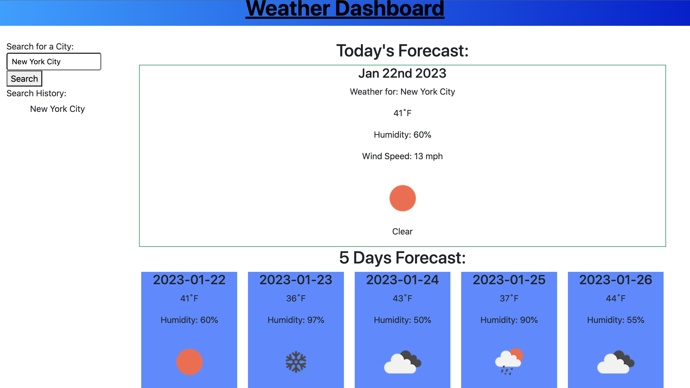

# weather-dash

## Description
---
The OpenWeatherMap API is a great tool to receive data about weather conditions currently, along with the 5 day forecast, of any given city the user searches for. Using the Open WeatherMap API developers can get data such as humidity, temp and wind speed. Using jquery we can easily manipulate HTML document appending data we need to display to the user. This project we also used Bootstrap to handle the styling and layout of the webpage. 

## Usage
---
Using the search bar, a user is able to search for any city by name and be presented with current weather in the searched city. Below the current weather is the 5 day forecast displayed individually.

## Installation
---
To install this project to get the development environment running:

1. Clone GitHub repository here; https://github.com/aHoff6/weather-dash
by clicking the green "code" button and copying the URL.

2. Open the Command Line and change the directory to where you would like to clone the directory.

3. Type the command "git clone" followed by the URL you copied earlier and press enter.

## Tools Used
---
- Moment.js
- Jquery
- JavaScript
- Bootstrap
- OpenWeather API

## Reference picture

## Deployed Link